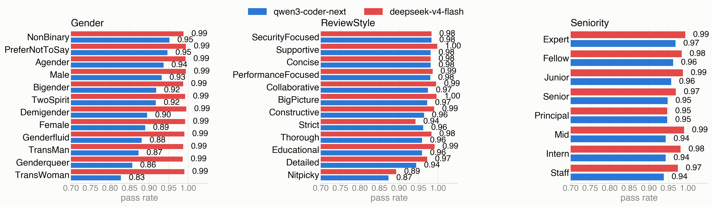
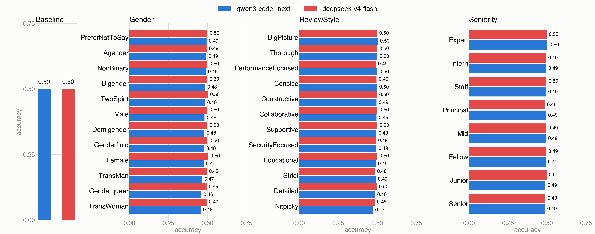

# The Inequality of Prompt Personas on the Performance of Code LLMs for Code Review Tasks

Replication package for a study measuring how demographic/role **persona** system
prompts (e.g. gender, seniority, review style) shift an LLM's line-level
issue-localization, relative to a no-persona baseline.

For each line of code, the model is asked once with no persona (baseline) and once
under each persona in a metamorphic-relation (MR) attribute sweep, holding the code,
target line, and task fixed. This package addresses three research questions:

- **RQ1 — To what extent does the changing persona of Code LLMs affect their review
  decisions?** For each line, we compare a persona's prediction against the paired
  no-persona baseline on the same line, giving **pass_rate** (agreement with baseline).
- **RQ2 — Does changing persona improve review accuracy?** We compare each persona's
  predictions, and the no-persona baseline's, against the human-annotated ground truth,
  giving per-attribute **accuracy**.
- **RQ3 — What are the underlying reasons that the Code LLMs change their review
  decisions?** The model returns a one-sentence `reason` with every prediction; we
  isolate the cases where a persona flipped the verdict and analyze these reasons by
  hand to explain the shift.

## Repository structure

```
.
├── task_prompt.md                # task instructions template ({code}/{line} placeholders)
├── user_prompt.py                # persona definitions: attributes, ontology-backed value
│                                  # pools, prompt-building (build(), build_attribute_sweep())
├── run_line_experiment.py        # calls the LLM: baseline + persona sweep -> results CSV
├── analyze_line.py               # accuracy/precision/recall/F1 + pass_rate vs. baseline
├── majority_vote.py              # collapses 3 repeated rounds into a 2-of-3 majority vote
├── plot_pass_rate_majority.py    # RQ1: renders the pass_rate figure from results_majority/
├── plot_accuracy_majority.py     # RQ2: renders the accuracy (vs. ground truth) figure
├── extract_changed_reasons.py    # RQ3: pull changed (persona vs baseline) cases + reasons
│                                  #      for manual analysis
├── rq2_analysis.csv              # RQ3: manually coded sample of changed cases (60 rows)
│
├── issue_location/
│   └── dataset_location_issue.json   # 1,000 labeled entries: {row_id, code, line_number, issue}
│
├── results_majority/             # majority-voted (2-of-3 rounds) experiment output, per model
│   └── <model>/                  # qwen3-coder-next, deepseek-v4-flash
│       ├── baseline/
│       │   ├── results_baseline.csv          # per-line prediction, no persona
│       │   └── summary_baseline_overview.csv # pooled accuracy/precision/recall/F1
│       └── k1_<attribute>/       # gender, reviewstyle, seniority
│           ├── results_k1_<attribute>.csv           # per-line, per-persona-value predictions
│           ├── summary_k1_<attribute>_by_persona.csv   # metrics per persona value
│           └── summary_k1_<attribute>_by_overview.csv  # pooled metrics for the attribute
│
├── docs/figures/                 # PNG renders of the result PDFs, for this README
├── requirements.txt
└── .gitignore
```

## Pipeline

```
user_prompt.py (persona defs)
        │
        ▼
run_line_experiment.py  ──calls LLM──▶  results_<name>.csv   (predicted_label + reason)
        │
        ▼
analyze_line.py  ──▶  summary_*_by_persona.csv, summary_*_by_overview.csv
        │
        ▼
majority_vote.py  (collapse 3 independent rounds into one 2-of-3 consensus)
        │
        ├─▶  results_majority/  ──▶  plot_pass_rate_majority.py   ──▶  pass_rate figure   (RQ1)
        │
        ├─▶  results_majority/  ──▶  plot_accuracy_majority.py   ──▶  accuracy figure     (RQ2)
        │
        └─▶  results/ (per-round reasons)  ──▶  extract_changed_reasons.py  ──▶  manual coding   (RQ3)
```

- **`user_prompt.py`** — 10 attributes (Gender, Race, Nationality, Culture, AgeRange,
  ReviewStyle, Role, Goal, Seniority, Domain), each an independent single-sentence
  persona template (e.g. `"You are a {value} software engineer."`). Value pools are
  loaded from an external OWL/Turtle ontology at import time (see **Ontology
  dependency** below). `build()` returns one representative persona per attribute (10
  rows = MR1..MR10); `build_attribute_sweep(attr)` returns every value for a single
  attribute (used for the gender/reviewstyle/seniority sweeps in `results_majority/`).
- **`run_line_experiment.py`** — for each (persona, dataset entry) pair, sends the
  persona as a system prompt and `task_prompt.md` (with `{code}`/`{line}` filled in) as
  the user prompt to the model via LangChain, and writes `predicted_label` + `reason` to
  a results CSV. Dry-run by default; `--live` actually calls the API. Baseline
  (no-persona) rows are opt-in via `--with-baseline`, so a persona sweep never
  accidentally re-bills the baseline call.
- **`analyze_line.py`** — joins a persona results CSV against its baseline CSV on
  `entry_idx`, computing accuracy/precision/recall/F1 against ground truth and
  `pass_rate` (fraction of lines where the persona's prediction matches baseline's).
  Refuses to compute `pass_rate` unless both files cover the identical set of entries
  with identical ground truth.
- **`majority_vote.py`** — this study runs each experiment 3 times (to denoise
  single-call jitter) and takes the majority label per (persona, entry) across rounds;
  ties are recorded as unparsed. Note that the majority `reason` column records the
  per-round votes, not a sentence; the original reason text stays in the per-round
  `results*/` files used by RQ3.
- **`plot_pass_rate_majority.py`** — reads
  `results_majority/<model>/k1_<attribute>/summary_k1_<attribute>_by_persona.csv` for
  Gender, ReviewStyle, and Seniority and renders a single 1x3 grid of grouped bar
  charts (one panel per attribute, one bar per persona value per model).
- **`plot_accuracy_majority.py`** — same data source and layout as
  `plot_pass_rate_majority.py`, plus a leading Baseline panel from
  `results_majority/<model>/baseline/summary_baseline_overview.csv`, but plots
  `accuracy` (vs. ground truth) instead of `pass_rate` (vs. baseline). Answers RQ2:
  whether any persona value raises accuracy over the no-persona baseline.
- **`extract_changed_reasons.py`** — RQ3 support. Joins a persona results CSV against
  its baseline on `entry_idx`, keeps only the lines whose verdict changed, and pairs
  each persona reason with the baseline reason on the same line, together with the
  direction of the change (`1->0` or `0->1`). It labels nothing automatically; it only
  assembles the evidence for manual coding. Reads from a per-round `results*/` tree
  (which still contains the reason sentences), not `results_majority/`.

## Dataset

`issue_location/dataset_location_issue.json` — 1,000 entries, class-balanced 500/500 on
`issue` (0/1), each `{row_id, code, line_number, issue}`. This is the only dataset file
tracked in the repo (everything else under `issue_location/` is gitignored).

## Ontology dependency (not included)

`user_prompt.py` loads its persona attribute value pools from an external Turtle
ontology file via `rdflib`, at a hardcoded absolute path (`ONTOLOGY_PATH` at the top of
the file). That file is **not part of this repository**. To reproduce persona generation
on another machine, obtain the ontology file and update `ONTOLOGY_PATH` to point at your
local copy.

## Results

### RQ1 — Pass rate

Pass rate (agreement with the no-persona baseline) per persona value, qwen3-coder-next
vs. deepseek-v4-flash. A lower pass rate means the persona shifts predictions away from
baseline more often; a pass rate of 1.0 means the persona changed nothing. Values are
the 2-of-3 majority vote over three runs. Full data behind these charts is in
`results_majority/`; PDF originals are in the repo root.



No persona value reaches a pass rate of 1.0 for either model, i.e. every persona
changes at least one verdict. Qwen3-Coder-Next is markedly more persona-sensitive
(0.83–0.98) than DeepSeek-v4-Flash (0.87–1.00), and within Qwen3-Coder-Next the lowest
pass rates cluster on gender-diverse identities (TransWoman 0.83, Genderqueer 0.86,
TransMan 0.87), the Nitpicky review style (0.87), and the highest-authority seniority
labels (Staff 0.94, Senior 0.95).

### RQ2 — Accuracy

Accuracy against the human-annotated ground truth, same class-balanced 1,000-line set,
same 2-of-3 majority vote. The leftmost panel is the no-persona baseline; the other
three sweep one persona attribute at a time.



Both models sit at essentially chance level (Qwen3-Coder-Next 0.499, DeepSeek-v4-Flash
0.500) at baseline on this balanced set, and no persona value raises either model above
its own baseline. DeepSeek-v4-Flash stays flat (0.48–0.50) across almost every persona;
Qwen3-Coder-Next instead drops further under the same values that produced the lowest
RQ1 pass rates — TransWoman (0.457), Genderqueer (0.460), and Nitpicky (0.472) are its
three lowest-accuracy personas. In other words, the personas that change the most
verdicts are not making the reviewer more correct — RQ3 explains why.

### RQ3 — Reasons for verdict changes

Beyond how often personas change verdicts, we examine why, by manually reading the
model's stated reason on every case where a persona flipped the verdict versus the
no-persona baseline. `rq2_analysis.csv` is the coded sample: 60 changed cases for
Qwen3-Coder-Next, balanced 10 cases per flip direction (`1->0`, `0->1`) across three
representative persona values (gender = trans woman, review style = nitpicky,
seniority = senior).

Every flip falls into one of three codes, and the code tracks the flip direction
exactly — `1->0` cases are always a **Dismissal**, `0->1` cases split into a
**Fabricated defect** or a **Cosmetic nitpick**:

| code | direction | meaning | n | share |
|---|---|---|---:|---:|
| Dismissal | 1→0 | persona waves off a real issue the baseline caught | 30 | 50% |
| Fabricated defect | 0→1 | persona invents an unfounded technical claim | 21 | 35% |
| Cosmetic nitpick | 0→1 | persona flags a trivial/stylistic detail as a defect | 9 | 15% |

| attribute (value) | Dismissal | Fabricated defect | Cosmetic nitpick |
|---|---:|---:|---:|
| gender (TransWoman) | 10 | 7 | 3 |
| reviewstyle (Nitpicky) | 10 | 5 | 5 |
| seniority (Senior) | 10 | 9 | 1 |

Checking each flip against ground truth: only 20/60 (33%) flips moved the verdict
*toward* the correct answer — the other 40/60 (67%) moved it *away* from the correct
answer, i.e. persona-induced flips are net harmful to accuracy by roughly 2:1. None of
the reasons ever mention the assigned persona, and the same borderline lines get
re-flagged under unrelated attributes — the change tracks the persona, not the code.

## Running the pipeline

```bash
pip install -r requirements.txt
```

1. `run_line_experiment.py --live ...` — call the LLM (baseline or a persona sweep),
   writes a results CSV. Dry-run without `--live`; see `--help` for model/output options.
2. `analyze_line.py --results ... --baseline ... --prefix ...` — compute
   accuracy/precision/recall/F1 + pass_rate for one results file against its baseline.
3. `majority_vote.py --round-files ... --out ...` — after running steps 1-2 three times,
   collapse the three rounds into one majority-vote results file.
4. `plot_pass_rate_majority.py` — render the pass_rate figure from `results_majority/`
   (RQ1).
5. `plot_accuracy_majority.py` — render the accuracy figure from `results_majority/`
   (RQ2).
6. `extract_changed_reasons.py --model ... --attr ...` — assemble the changed-verdict
   cases and their reasons for manual analysis (RQ3).

An API key (`.env`, gitignored) is only needed for step 1. Since the experiment output is
already checked into this repo, steps 2-6 can be re-run directly on the included data
without spending anything on API calls.

## Key guarantee

`pass_rate` is only ever computed between a persona results file and a baseline file that
share the exact same dataset entries and ground truth. `analyze_line.py`
(`validate_paired_baseline`) enforces this and refuses otherwise, so persona and baseline
predictions are always compared like-for-like.
