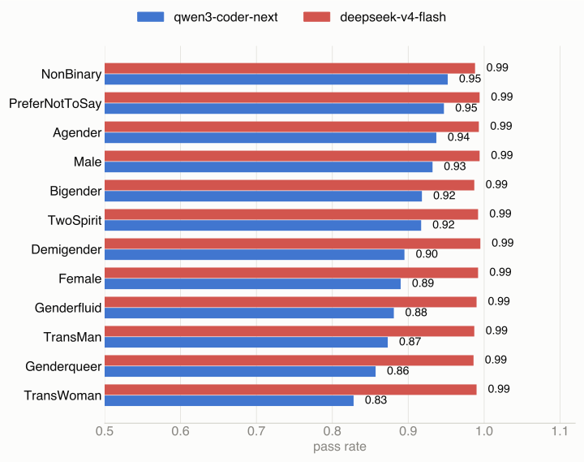
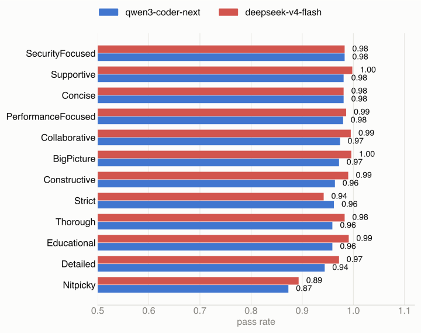
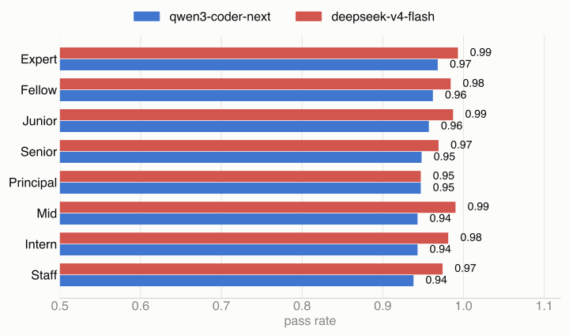

# The Inequality of Prompt Personas on the Performance of Code LLMs for Code Review Tasks

Replication package for a study measuring how demographic/role **persona** system
prompts (e.g. gender, seniority, review style) shift an LLM's line-level
issue-localization accuracy, relative to a no-persona baseline.

For each line of code, the model is asked once with no persona (baseline) and once
under each persona in a metamorphic-relation (MR) attribute sweep. Comparing a
persona's predictions against the paired baseline's on the same lines gives
**pass_rate** (agreement with baseline) and per-attribute accuracy/precision/recall/F1,
which is what this package reproduces.

## Repository structure

```
.
├── task_prompt.md               # task instructions template ({code}/{line} placeholders)
├── user_prompt.py                # persona definitions: attributes, ontology-backed value
│                                  # pools, prompt-building (build(), build_attribute_sweep())
├── run_line_experiment.py        # calls the LLM: baseline + persona sweep -> results CSV
├── analyze_line.py               # accuracy/precision/recall/F1 + pass_rate vs. baseline
├── majority_vote.py              # collapses 3 repeated rounds into a 2-of-3 majority vote
├── plot_pass_rate_majority_split.py  # renders the pass_rate figures from results_majority/
│
├── issue_location/
│   └── dataset_location_issue.json   # 1,000 labeled entries: {row_id, code, line_number, issue}
│
├── results_majority/             # majority-voted (2-of-3 rounds) experiment output, per model
│   └── <model>/                  # qwen3-coder-next, deepseek-v4-flash
│       ├── baseline/
│       │   ├── results_baseline.csv          # per-line prediction, no persona
│       │   └── summary_baseline_overview.csv # pooled accuracy/precision/recall/F1
│       └── k1_<attribute>/       # gender, reviewstyle, seniority
│           ├── results_k1_<attribute>.csv           # per-line, per-persona-value predictions
│           ├── summary_k1_<attribute>_by_persona.csv   # metrics per persona value
│           └── summary_k1_<attribute>_by_overview.csv  # pooled metrics for the attribute
│
├── docs/figures/                 # PNG renders of the result PDFs, for this README
├── requirements.txt
└── .gitignore
```

## Pipeline

```
user_prompt.py (persona defs)
        │
        ▼
run_line_experiment.py  ──calls LLM──▶  results_<name>.csv
        │
        ▼
analyze_line.py  ──▶  summary_*_by_persona.csv, summary_*_by_overview.csv
        │
        ▼
majority_vote.py  (collapse 3 independent rounds into one 2-of-3 consensus)
        │
        ▼
results_majority/  ──▶  plot_pass_rate_majority_split.py  ──▶  figures
```

- **`user_prompt.py`** — 10 attributes (Gender, Race, Nationality, Culture, AgeRange,
  ReviewStyle, Role, Goal, Seniority, Domain), each an independent single-sentence
  persona template (e.g. `"You are a {value} software engineer."`). Value pools are
  loaded from an external OWL/Turtle ontology at import time (see **Ontology
  dependency** below). `build()` returns one representative persona per attribute (10
  rows = MR1..MR10); `build_attribute_sweep(attr)` returns every value for a single
  attribute (used for the gender/reviewstyle/seniority sweeps in `results_majority/`).
- **`run_line_experiment.py`** — for each (persona, dataset entry) pair, sends the
  persona as a system prompt and `task_prompt.md` (with `{code}`/`{line}` filled in) as
  the user prompt to the model via LangChain, and writes `predicted_label` + `reason` to
  a results CSV. Dry-run by default; `--live` actually calls the API. Baseline
  (no-persona) rows are opt-in via `--with-baseline`, so a persona sweep never
  accidentally re-bills the baseline call.
- **`analyze_line.py`** — joins a persona results CSV against its baseline CSV on
  `entry_idx`, computing accuracy/precision/recall/F1 against ground truth and
  `pass_rate` (fraction of lines where the persona's prediction matches baseline's).
  Refuses to compute `pass_rate` unless both files cover the identical set of entries
  with identical ground truth.
- **`majority_vote.py`** — this study runs each experiment 3 times (to denoise
  single-call jitter) and takes the majority label per (persona, entry) across rounds;
  ties are recorded as unparsed. Only the resulting `results_majority/` consensus is
  published here — the 3 individual rounds are not included.
- **`plot_pass_rate_majority_split.py`** — reads
  `results_majority/<model>/k1_<attribute>/summary_k1_<attribute>_by_persona.csv` for
  Gender, ReviewStyle, and Seniority and renders one horizontal-bar PDF per attribute,
  one bar per persona value per model.

## Dataset

`issue_location/dataset_location_issue.json` — 1,000 entries, class-balanced 500/500 on
`issue` (0/1), each `{row_id, code, line_number, issue}`. This is the only dataset file
tracked in the repo (everything else under `issue_location/` is gitignored).

## Ontology dependency (not included)

`user_prompt.py` loads its persona attribute value pools from an external Turtle
ontology file via `rdflib`, at a hardcoded absolute path
(`ONTOLOGY_PATH` at the top of the file). That file is **not part of this repository**.
To reproduce persona generation on another machine, obtain the ontology file and update
`ONTOLOGY_PATH` to point at your local copy.

## Results

Pass rate (agreement with the no-persona baseline) per persona value, qwen3-coder-next
vs. deepseek-v4-flash — lower means the persona shifts predictions away from baseline
more often. Full data behind these charts is in `results_majority/`; PDF originals are
in the repo root.

**Gender**


**Review style**


**Seniority**


## Running the pipeline

```bash
pip install -r requirements.txt
```

1. `run_line_experiment.py --live ...` — call the LLM (baseline or a persona sweep), writes a results CSV. Dry-run without `--live`; see `--help` for model/output options.
2. `analyze_line.py --results ... --baseline ... --prefix ...` — compute accuracy/precision/recall/F1 + pass_rate for one results file against its baseline.
3. `majority_vote.py --round-files ... --out ...` — after running steps 1-2 three times, collapse the three rounds into one majority-vote results file.
4. `plot_pass_rate_majority_split.py` — render the pass_rate figures from `results_majority/`.

An API key (`.env`, gitignored) is only needed for step 1. Since `results_majority/` is
already checked into this repo, steps 2-4 can be re-run directly on the included data
without spending anything on API calls.

## Key guarantee

`pass_rate` is only ever computed between a persona results file and a baseline file
that share the exact same dataset entries and ground truth — `analyze_line.py`
(`validate_paired_baseline`) enforces this and refuses otherwise, so persona and
baseline predictions are always compared like-for-like.
